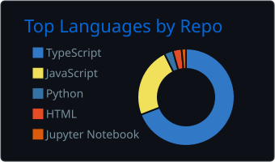
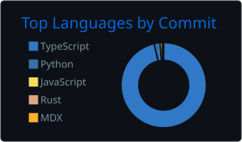

# Paulo Oliveira

**Senior Software Engineer**

Product engineering · Scalable web platforms · Frontend architecture · Backend APIs

 

---

## About

Senior Software Engineer at **Popstand** with 5+ years building production software across web platforms, SaaS products, marketplaces, internal tools, design systems, and APIs.

I focus on translating product requirements into maintainable, production-ready systems. My work spans the full development lifecycle: frontend architecture, backend API design, code reviews, refactoring, debugging, and release verification.

I care about architecture quality, developer experience, and delivering software that scales with the product.

---

## Professional Impact

- 5+ years at Popstand building and maintaining production software
- Worked across client-facing products, SaaS platforms, marketplaces, internal tools, admin panels, and design systems
- Strong experience in frontend architecture (React, Next.js) and backend API development (Node.js, NestJS, GraphQL)
- Active in PR reviews, debugging production issues, refactoring legacy code, and verifying releases
- Built complex UI workflows, multi-step forms, admin systems, and product engineering features
- Contributed to mobile development with React Native
- Integrated third-party services, payment systems, and document signing workflows
- Applied AI tooling and automation to accelerate development workflows

---

## GitHub Activity

 

 

> Note: Stats are generated as static SVG files from GitHub data. Private/company work should only appear as aggregated activity and must not expose private repository names or confidential project details.

---

## Tech Stack

### Core

### Frontend / Product UI

### Backend / Data

### Platforms / Tools

### Other Interests

---

## Selected Projects

### [ScaleCraft-Network](https://github.com/PauloHSOliveira/ScaleCraft-Network)
Blockchain learning project focused on Rust, distributed systems, and scalable network architecture. Exploring consensus mechanisms, peer-to-peer networking, and systems programming.

### [clicksign-library](https://github.com/PauloHSOliveira/clicksign-library)
TypeScript library for integrating with the ClickSign REST API. Provides a clean, typed, and maintainable interface for sending and managing digital signature contracts via functional programming patterns.

### [new-portfolio](https://github.com/PauloHSOliveira/new-portfolio)
Personal portfolio and professional website for showcasing projects, experience, and technical work. Live at [pholiveira.dev](https://pholiveira.dev).

---

## Currently Exploring

- **Go** — efficient backend systems and concurrent programming
- **NestJS** — modular, scalable API architecture
- **Ethical hacking & application security** — understanding vulnerabilities to build more secure software
- **AI agents & developer tooling** — automation and productivity workflows
- **Rust & distributed systems** — systems programming and network architecture

---

## Contact

| | |
|---|---|
| **Website** | [pholiveira.dev](https://pholiveira.dev) |
| **Email** | [contato@pholiveira.dev](mailto:contato@pholiveira.dev) |
| **LinkedIn** | [linkedin.com/in/paulo-oliveira-ph](https://www.linkedin.com/in/paulo-oliveira-ph/) |

---

Open to collaborations, technical discussions, and interesting problems.

